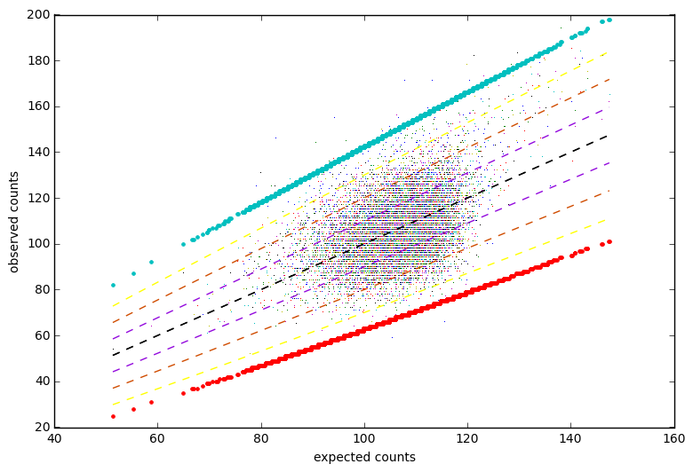
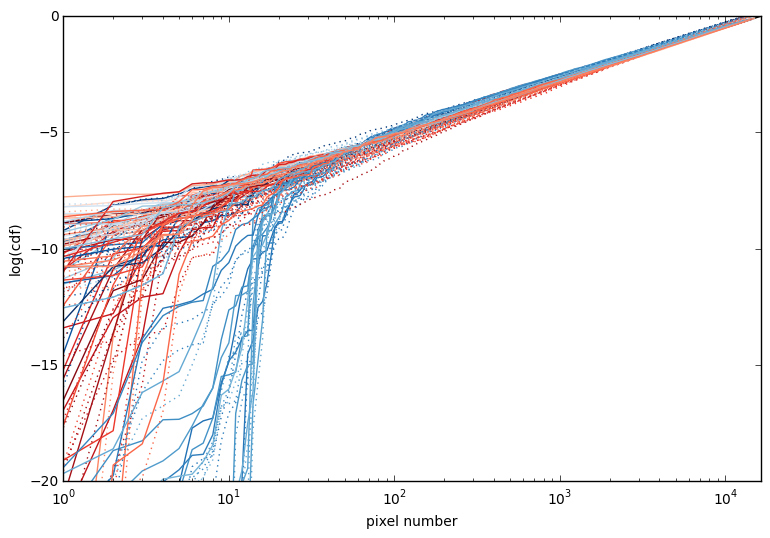
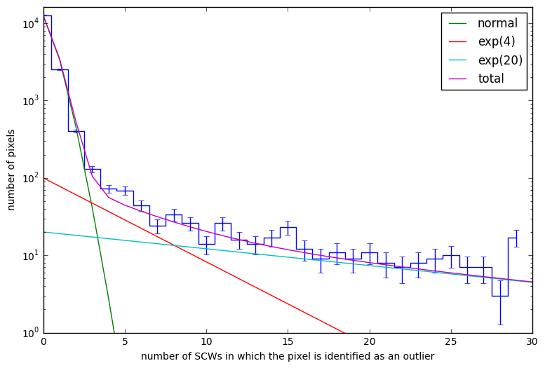

Bad Pixels
==========

Introduction
------------

ISGRI has a *noisy pixel handling system* which can automatically
detect and temporarily disable pixels which cause excessively many
events. The standard data processing performs further
filtering. Still, the resulting data sets contain some pixels that
behave in an anomalous way that can be identified.

Once identified these outlier pixels can either be excluded from the
analysis or their count rate can be estimated from other, related
pixels.

Identifying anomalous pixels
----------------------------

The method to identify outlier pixels as implemented in :ref:`cubestack`
looks at the statistical distribution of pixel counts compared to a
reference count rate image. when applied to empty field observations,
this identifies anomalously *dark* and *hot* pixels.

   Distribution of expected and observed counts.

   The dashed lines show observed = expected ± {1, 2, 3} σ. The
   bullets show the inverse cumulative Poisson distribution/survival
   functions corresponding to the probability of a deviation of 4 σ.

   Pixel probability distributions

   This plot shows the sorted logarithms of the cumulative Poisson
   distribution function (blue) and the survival function (red) for a
   set of science windows. In the case of purely statistical scatter,
   a straight line starting at :math:`-\log 128^2 \approx -9.7` would
   be expected. Pixels lying significantly below are outliers.

   The dotted lines show the raw distribution functions while the
   solid lines are normalised to the 64\ :sup:`th` pixel to eliminate
   the probability decrease introduced by a systematic mismatch of the
   background intensity distribution.

Frequency of outlier pixels
---------------------------

After the outlier identification has been performed for a large number
of science windows, it is instructive to look at the frequency
distribution of outlier pixels. This shows that there is a large
majority of pixels that are never outliers. These are followed by a
number of pixels which are identified as outliers a handful of times,
but the frequency of these identifications is consistent with a
Poisson distribution with the same expected value as the threshold
probability used in the outlier identification. These pixels therefore
are just identified as outliers because of statistical
fluctuations. Pixels which are identified as outliers 3–4 or more
times follow a different distribution which seems to be similar to a
sum of two exponential distributions with scale parameters much larger
than the expectation value of the Poisson distribution.

   Frequency distribution of outlier pixel identifications

   Histogram of the number if pixels that have been identified as
   outliers a given number of times. The *normal* curve shows a
   Poisson distribution with an expectation value of two times the
   cumulative distribution function of a normal distribution at the
   n-sigma threshold used in outlier identification. The 4σ threshold
   used in this example corresponds to an expectation value of ``2 *
   norm.cdf(-4.0) * 4350`` ≈ 0.28 science windows (out of 4350). The
   exponential distributions with scale parameters of 4 and 20 have
   been put in by eye for illustrative purposes.
